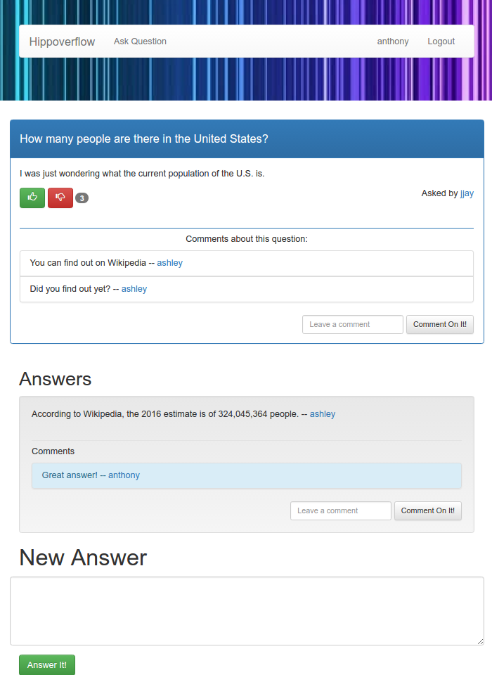
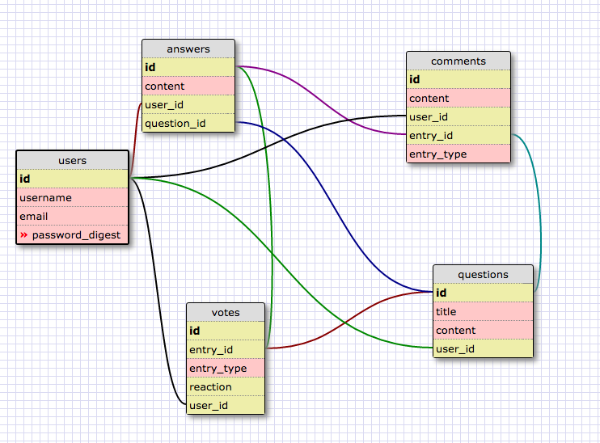

# hippoverflow

Ask about anything



[View more screenshots](public/images/screenshots/)

## Team

* [Buck Melton](https://github.com/buckmelton)
* [Jonathan Nicolas](https://github.com/jonathanNicolas)
* [Lyudmila Arinich](https://github.com/ftBessmann)
* [Renan Martins](https://github.com/nbkhope)

## MVP Features

```
A user can post a question
A user can answer other user's questions
A user can respond to questions and answers
A user can vote up/down on questions and answers only once
A user can vote up/down on the responses only once
A user can only post a question, answer a question, vote, if logged in
A user can view all questions, answers, and votes even if logged out
A user has a profile
```

```
A user can choose the best answer to his question
A user can list all the responses in chronological order
A user will see the best answer first, followed by the most highly voted
A user can list all the questions ordered by highest voted, most recent, or "trending"
```

## Database Schema



## Installation

Run bundle to install all dependencies:

```
bundle install
```

Create, migrate, and seed the database using rake:

```
bundle exec rake db:create db:migrate db:seed
```

Run the server using shotgun:

```
bundle exec shotgun config.ru
```

The web app will be available at <http://localhost:9393>
